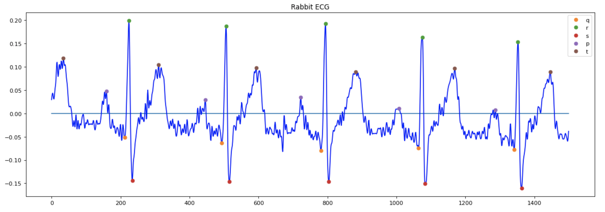

# ECG
Project on writing a library for ECG processing oriented on lab anymals: dogs, rabbits and mice.

Pull the code and run ```python setup.py build``` from the root directory. Than you can use it as a package.

```from ecg_detection import ecg```

To use it on your own dataset, change the path : ```ecg.path ='my/path'```

Note that uploading files implies the following structure of the files:
- path
  * animal_type
    * animal_item
        * recordings for this animal

For example:
- my/path
  * dogs
    * dog_1
        * dog_1_recording.txt
        
### Sample Results  

Detection for a rabbit 

    
 
 * Note that there are may be problems with peaks detection if your recording has big baseline drift and r-peaks are down-directed. In this case, revert the recording manually and try agaim. We are currently working on total baseline removing without changing the ECG recording (buttherworth may shift J point).
 * For more examples and information go [here](https://docs.google.com/presentation/d/1cPWJj1L2Zv2QK4zjxASo4jc2PzlJpYbPFEI6EiVAd7c/edit?usp=sharing) or see the pdf attanched
 * Examples of fucntion usage may be found in the jupiter notebooks
